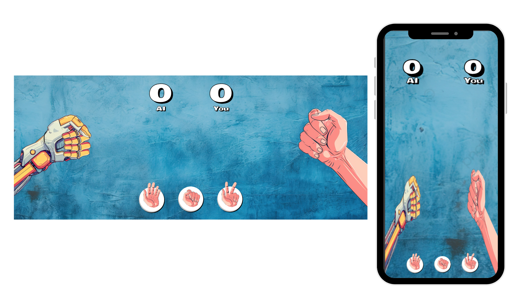

<h1 align="center" style="font-weight: bold;">Dev Jokenpo 💻</h1>

 

 <a href="#tech">Tecnologias</a> • 
 <a href="#started">Começando</a> • 
  •

     <a href="https://hcinfo9.github.io/Desafio-Jokenpo/">📱 Visite este Projeto</a>

<h2 id="layout">🎨 Layout:</h2>

    

<h2 id="tech">💻 Tecnologias:</h2>
  <ul>
      <li></li>
      <li></li>
      <li></li>
      
  </ul>
<h2 id="started">🚀 Descrição:</h2> 

Dev Jokenpo é uma aplicação web simples desenvolvida para simular um jogo de jokenpo, também conhecido como pedra, papel e tesoura. 
A aplicação foi construída utilizando HTML, CSS e JavaScript.  

<h3>Pre-Requisitos:</h3> 

Um navegador web moderno, como Google Chrome, Mozilla Firefox, Safari, ou Microsoft Edge.
Conexão com a internet para carregar recursos externos.  

<h3>Executando o Projeto:</h3>

Para executar a aplicação localmente, siga estas etapas:

<ul>
  <li>Acesse o projeto clicando em visite este Projeto, no começo da pagina.  
</li>
  <li>Porém se preferir pode executar baixando o meu projeto e executando o arquivo index.html em seu navegador web preferido.</li>
  <li>Selecione entre as 3 opções a que deseja para começar o jogo.</li>
  <li>Caso queira continuar o jogo basta clicar em jogar novamente.</li>
  <li>Se desejar zerar o placar e começar do zero, clique em resetar</li>
</ul>  

<h2 id="colab">🤝 Colaboradores:</h2>

Um obrigado especial aos colaboradores do Projeto.

<table>
  <tr>
    <td align="center">
      <a href="#">
         
        
          <b>Henrique Donato</b>
        
      </a>
    </td>
</table>
